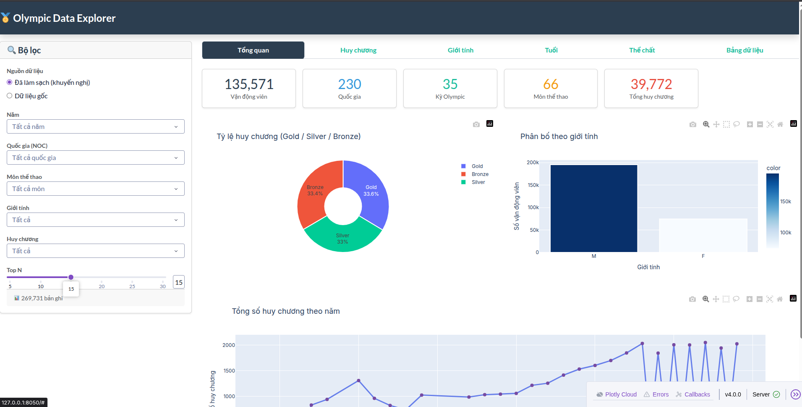
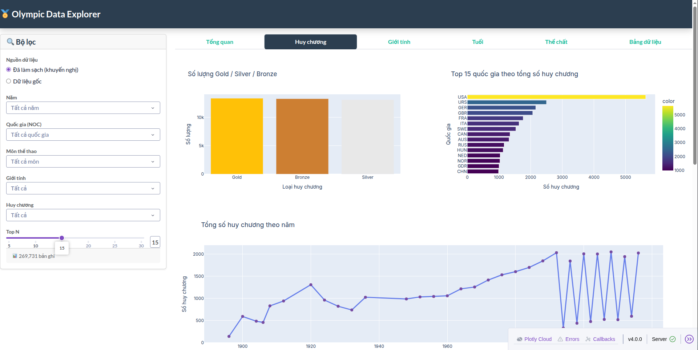
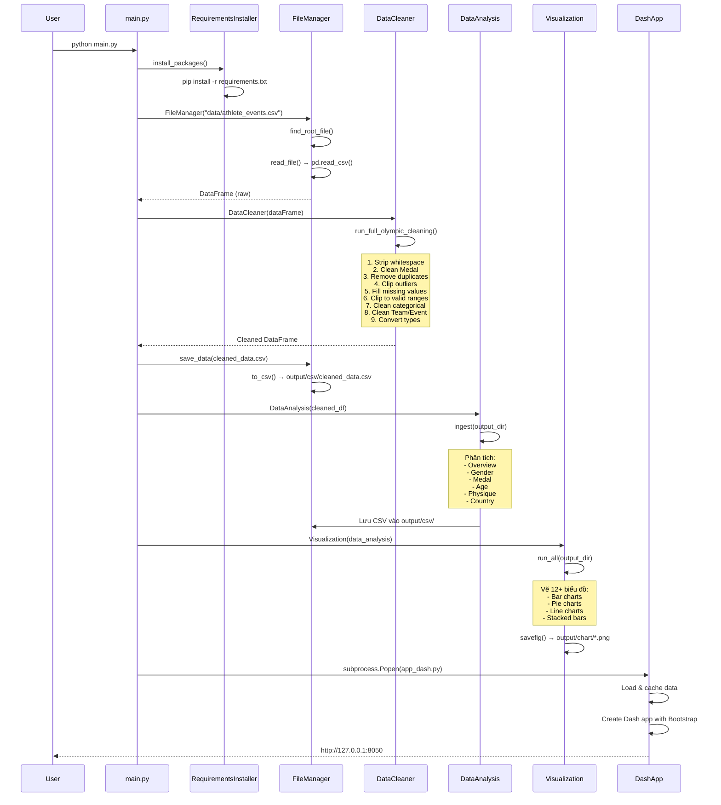
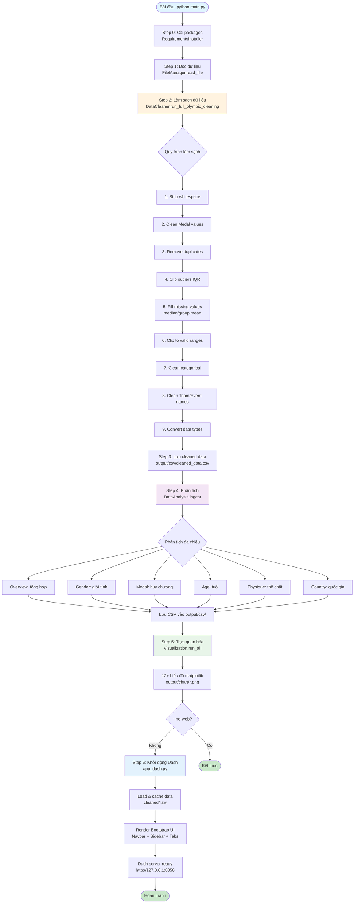
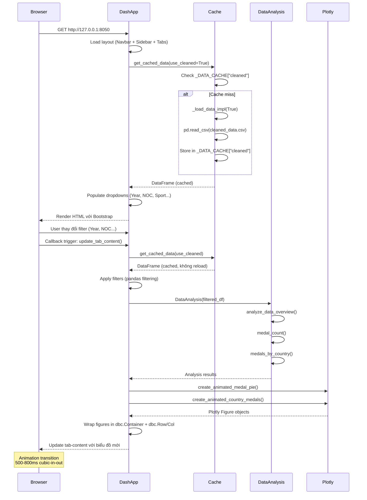
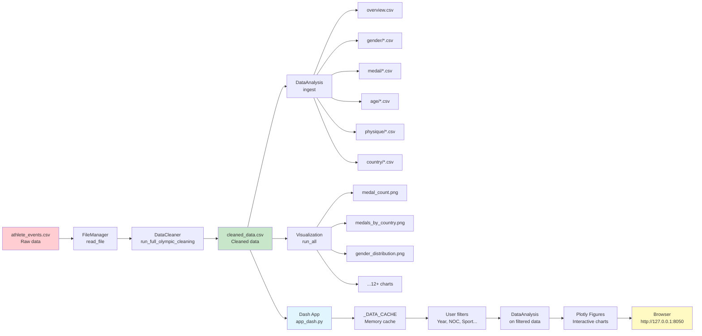
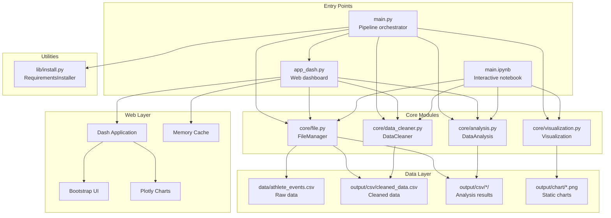
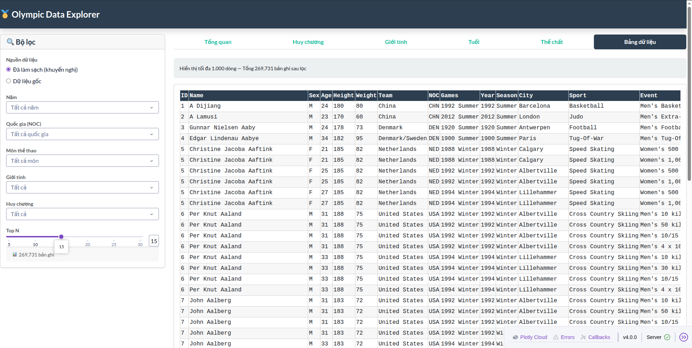

# 🏅 Olympic Data Explorer

Hệ thống trực quan hóa và phân tích dữ liệu Olympic với giao diện web hiện đại, animation mượt mà và khả năng lọc dữ liệu theo thời gian thực.



## 📋 Mục lục

- [Tổng quan](#tổng-quan)
- [Tính năng](#tính-năng)
- [Cấu trúc dự án](#cấu-trúc-dự-án)
- [Cài đặt](#cài-đặt)
- [Sử dụng](#sử-dụng)
- [Pipeline xử lý dữ liệu](#pipeline-xử-lý-dữ-liệu)
- [Luồng hoạt động hệ thống](#luồng-hoạt-động-hệ-thống)
- [Kiến trúc hệ thống](#kiến-trúc-hệ-thống)
- [Các module chính](#các-module-chính)
- [Output](#output)

---

## 🎯 Tổng quan

Dự án này cung cấp một hệ thống hoàn chỉnh để:
- **Làm sạch dữ liệu** Olympic từ file CSV gốc
- **Phân tích thống kê** đa chiều (huy chương, giới tính, tuổi, thể chất, quốc gia)
- **Trực quan hóa** bằng biểu đồ tĩnh (matplotlib) và tương tác (Plotly)
- **Dashboard web** với Plotly Dash, Bootstrap UI, và animation mượt mà
- **Lọc dữ liệu** theo thời gian thực với cache thông minh

**Dữ liệu:** Dataset `athlete_events.csv` chứa thông tin về các vận động viên Olympic từ năm 1896 đến nay.

---

## ✨ Tính năng

### 📊 Phân tích dữ liệu
- **Tổng quan:** Thống kê tổng hợp (số VĐV, quốc gia, kỳ Olympic, môn thể thao, huy chương)
- **Huy chương:** Phân tích Gold/Silver/Bronze theo quốc gia, năm, môn thể thao
- **Giới tính:** Phân bố và thành tích theo giới tính
- **Tuổi:** Phân bố nhóm tuổi và tỷ lệ đạt huy chương
- **Thể chất:** So sánh chiều cao, cân nặng, BMI giữa người đạt huy chương và không đạt
- **Quốc gia:** Thành tích theo từng quốc gia qua các năm

### 🎨 Trực quan hóa
- **Biểu đồ tĩnh:** 12+ biểu đồ matplotlib lưu vào `output/chart/`
- **Dashboard tương tác:** Plotly Dash với animation transitions
- **Bộ lọc:** Năm, quốc gia (NOC), môn thể thao, giới tính, huy chương
- **Responsive:** Tự động điều chỉnh theo kích thước màn hình



### ⚡ Tối ưu hiệu năng
- **Cache dữ liệu:** Chỉ load 1 lần mỗi nguồn (cleaned/raw)
- **Lọc hiệu quả:** Pandas filtering thay vì serialize toàn bộ dataframe
- **Loading states:** Hiển thị spinner khi callback đang chạy

---

## 📁 Cấu trúc dự án

```
BTL_PYTHON/
├── main.py                 # Pipeline chính: cài đặt → xử lý → web
├── app_dash.py            # Ứng dụng Dash web với Bootstrap UI
├── data/
│   └── athlete_events.csv # Dữ liệu gốc Olympic
├── core/
│   ├── file.py            # FileManager: đọc/ghi CSV
│   ├── data_cleaner.py    # DataCleaner: làm sạch dữ liệu
│   ├── analysis.py        # DataAnalysis: phân tích thống kê
│   └── visualization.py   # Visualization: vẽ biểu đồ matplotlib
├── lib/
│   ├── install.py         # RequirementsInstaller: tự động cài packages
│   └── requirements.txt   # Danh sách dependencies
└── output/
    ├── csv/               # Kết quả phân tích CSV
    │   ├── overview/
    │   ├── gender/
    │   ├── medal/
    │   ├── age/
    │   ├── physique/
    │   └── country/
    └── chart/              # Biểu đồ matplotlib (PNG)
```

---

## 🚀 Cài đặt

### Yêu cầu hệ thống
- Python 3.8+
- pip

### Tạo môi trường ảo (khuyến nghị)

```bash
# Tạo virtual environment
python3 -m venv venv

# Kích hoạt môi trường ảo
# Linux/Mac:
source venv/bin/activate
# Windows:
# venv\Scripts\activate
```

### Cài đặt

Sau khi kích hoạt môi trường ảo, chạy một lệnh duy nhất:

```bash
python main.py
```

Script sẽ **tự động cài đặt** tất cả packages cần thiết từ `lib/requirements.txt` và chạy toàn bộ pipeline:
1. Tự động cài packages (pandas, plotly, dash, ...)
2. Đọc và làm sạch dữ liệu
3. Phân tích và xuất CSV
4. Tạo biểu đồ matplotlib
5. Khởi động web Dash tại `http://127.0.0.1:8050` (nếu không dùng `--no-web`)

**Lưu ý:** Nếu muốn cài packages thủ công trước:
```bash
pip install -r lib/requirements.txt
```

**Dependencies:**
- `pandas` - Xử lý dữ liệu
- `scikit-learn` - Machine learning utilities
- `matplotlib` - Biểu đồ tĩnh
- `plotly` - Biểu đồ tương tác
- `dash` - Web framework
- `dash-bootstrap-components` - Bootstrap UI components

---

## 💻 Sử dụng

### Chạy pipeline đầy đủ (kèm web)

```bash
python main.py
```

Sẽ tự động:
- Cài packages (nếu chưa có)
- Chạy toàn bộ pipeline
- Mở trình duyệt tại `http://127.0.0.1:8050`

### Chạy chỉ pipeline (không mở web)

```bash
python main.py --no-web
```

### Chạy web riêng

```bash
python app_dash.py
```

Mở trình duyệt: `http://127.0.0.1:8050`

### Chạy từng bước trong Jupyter Notebook

Xem `main.ipynb` để chạy từng step riêng lẻ.

---

## 🔄 Pipeline xử lý dữ liệu

### Sequence Diagram: Luồng xử lý chính



### Pipeline Flow Diagram



---

## 🏗️ Luồng hoạt động hệ thống

### Sequence Diagram: Web Dashboard (Dash App)



### Data Flow: Từ Raw CSV đến Dashboard



---

## 🏛️ Kiến trúc hệ thống

### Component Diagram



---

## 📦 Các module chính

### 1. `core/file.py` - FileManager

**Chức năng:** Quản lý đọc/ghi file CSV

**Phương thức chính:**
- `find_root_file(file_path)`: Tìm file từ project root
- `read_file()`: Đọc CSV thành pandas DataFrame
- `save_data(dataFrame, relative_path)`: Lưu DataFrame ra CSV

**Ví dụ:**
```python
fm = FileManager("data/athlete_events.csv")
df = fm.read_file()
fm.save_data(df, "output/csv/cleaned_data.csv")
```

### 2. `core/data_cleaner.py` - DataCleaner

**Chức năng:** Làm sạch dữ liệu Olympic

**Các bước trong `run_full_olympic_cleaning()`:**
1. **Strip whitespace:** Loại bỏ khoảng trắng thừa
2. **Clean Medal:** Chuẩn hóa giá trị Medal (Gold/Silver/Bronze/No Medal)
3. **Remove duplicates:** Xóa bản ghi trùng lặp
4. **Clip outliers:** Gán giá trị ngoại lai về biên (IQR method)
5. **Fill missing values:** Điền NA bằng median hoặc group mean (theo Sport+Sex)
6. **Clip to valid ranges:** 
   - Age: 5-100
   - Height: 100-250 cm
   - Weight: 25-300 kg
   - Year: 1896-2030
7. **Clean categorical:** Chuẩn hóa Sex, Season
8. **Clean Team/Event:** Loại bỏ ký tự đặc biệt
9. **Convert types:** Chuyển Age → int, Height/Weight → float

**Ví dụ:**
```python
cleaner = DataCleaner(df)
cleaner.run_full_olympic_cleaning()
cleaned_df = cleaner.get_data()
```

### 3. `core/analysis.py` - DataAnalysis

**Chức năng:** Phân tích thống kê đa chiều

**Các nhóm phân tích:**

#### Overview
- `analyze_data_overview()`: Tổng hợp (VĐV, quốc gia, kỳ Olympic, môn, huy chương)

#### Gender
- `analyze_data_by_gender()`: Phân bố và huy chương theo giới tính

#### Medal
- `medal_count()`: Tổng Gold/Silver/Bronze
- `medals_by_country()`: Top quốc gia
- `medals_by_year()`: Huy chương theo năm
- `medals_by_sport()`: Huy chương theo môn
- `medal_tally_table()`: Bảng tổng sắp (pivot table)

#### Age
- `age_summary()`: Tuổi trung bình/min/max
- `age_group_distribution()`: Phân bố nhóm tuổi (U20, 20-30, ...)
- `medal_ratio_by_age_group()`: Tỷ lệ đạt huy chương theo tuổi

#### Physique
- `physique_by_sport()`: Chiều cao/cân nặng/BMI theo môn
- `medal_vs_non_medal_physique()`: So sánh thể chất

#### Country
- `medals_by_country_year()`: Huy chương theo quốc gia + năm
- `country_performance(noc_code)`: Thành tích 1 quốc gia

**Ví dụ:**
```python
analysis = DataAnalysis(df)
overview = analysis.analyze_data_overview()
medal_count = analysis.medal_count()
analysis.ingest(output_dir="output/csv")  # Xuất tất cả CSV
```

### 4. `core/visualization.py` - Visualization

**Chức năng:** Vẽ biểu đồ matplotlib

**Các biểu đồ:**
- `plot_medals_by_country()`: Bar chart top quốc gia
- `plot_medal_count()`: Bar chart Gold/Silver/Bronze
- `plot_medal_count_pie()`: Pie chart tỷ lệ huy chương
- `plot_gender_distribution()`: Bar chart giới tính
- `plot_medals_by_year()`: Line chart theo năm
- `plot_medals_by_sport()`: Bar chart theo môn
- `plot_age_group_distribution()`: Bar chart nhóm tuổi
- `plot_medal_tally_stacked()`: Stacked bar Gold/Silver/Bronze
- `plot_physique_medal_vs_non_medal()`: So sánh thể chất

**Ví dụ:**
```python
vis = Visualization(analysis)
vis.run_all(output_dir=Path("output/chart"))
```

### 5. `app_dash.py` - Web Dashboard

**Chức năng:** Ứng dụng web tương tác với Plotly Dash

**Tính năng:**
- **Cache thông minh:** `_DATA_CACHE` lưu cleaned/raw data trong memory
- **Bootstrap UI:** Navbar, Sidebar (filters), Tabs
- **Callbacks:** Tự động cập nhật biểu đồ khi filter thay đổi
- **Animation:** Plotly transitions (500-800ms cubic-in-out)

**Cấu trúc:**
- **Sidebar:** Bộ lọc (Năm, NOC, Sport, Sex, Medal, Top N)
- **Tabs:** Tổng quan, Huy chương, Giới tính, Tuổi, Thể chất, Bảng dữ liệu
- **Biểu đồ:** Plotly Express và Graph Objects với animation

**Ví dụ callback:**
```python
@app.callback(
    Output('tab-content', 'children'),
    [Input('main-tabs', 'active_tab'),
     Input('year-filter', 'value'),
     ...]
)
def update_tab_content(tab, years, ...):
    df = get_cached_data(use_cleaned)  # Lấy từ cache
    df = df[df['Year'].isin(years)]  # Lọc
    analysis = DataAnalysis(df)
    # Tạo biểu đồ với animation
    return dbc.Container([...])
```

---

## 📊 Output

### CSV Files (`output/csv/`)

```
output/csv/
├── cleaned_data.csv              # Dữ liệu đã làm sạch
├── overview/
│   └── overview.csv              # Tổng hợp
├── gender/
│   ├── gender_counts.csv
│   ├── gender_percentage.csv
│   └── medal_by_gender.csv
├── medal/
│   ├── medal_count.csv
│   ├── medals_by_country.csv
│   ├── medals_by_year.csv
│   ├── medals_by_sport.csv
│   └── medal_tally_table.csv
├── age/
│   ├── age_summary.csv
│   ├── age_group_distribution.csv
│   ├── medal_ratio_by_age_group.csv
│   └── average_age_gold.csv
├── physique/
│   ├── physique_by_sport.csv
│   └── medal_vs_non_medal_physique.csv
└── country/
    ├── medals_by_country_year.csv
    └── country_performance_*.csv  # Mỗi quốc gia 1 file
```

### Charts (`output/chart/`)

- `medals_by_country.png` - Top quốc gia
- `medal_count.png` - Bar chart Gold/Silver/Bronze
- `medal_count_pie.png` - Pie chart tỷ lệ
- `gender_distribution.png` - Phân bố giới tính
- `medals_by_gender.png` - Huy chương theo giới tính
- `medals_by_year.png` - Line chart theo năm
- `medals_by_sport.png` - Top môn thể thao
- `country_most_gold.png` - Top quốc gia nhiều Gold
- `age_group_distribution.png` - Phân bố tuổi
- `medal_ratio_by_age_group.png` - Tỷ lệ huy chương theo tuổi
- `medal_tally_stacked.png` - Stacked bar Gold/Silver/Bronze
- `physique_medal_vs_non_medal.png` - So sánh thể chất

### Web Dashboard

- **URL:** `http://127.0.0.1:8050`
- **Tính năng:** Tương tác, lọc real-time, animation mượt mà



---

## 🔧 Troubleshooting

### Lỗi "Module not found"
```bash
pip install -r lib/requirements.txt
```

### Lỗi "File not found"
Đảm bảo có file `data/athlete_events.csv` trong thư mục project.

### Dash không khởi động
```bash
# Chạy trực tiếp để xem lỗi
python app_dash.py
```

### Port 8050 đã được sử dụng
Thay đổi port trong `app_dash.py`:
```python
app.run(debug=True, host='127.0.0.1', port=8051)
```

---

## 📝 License

Dự án này được phát triển cho mục đích học tập và nghiên cứu.

---

## 👥 Tác giả

BTL Python - Olympic Data Visualization Project

---

## 🙏 Tài liệu tham khảo

- [Pandas Documentation](https://pandas.pydata.org/)
- [Plotly Dash Documentation](https://dash.plotly.com/)
- [Dash Bootstrap Components](https://dash-bootstrap-components.opensource.faculty.ai/)
- [Matplotlib Documentation](https://matplotlib.org/)
